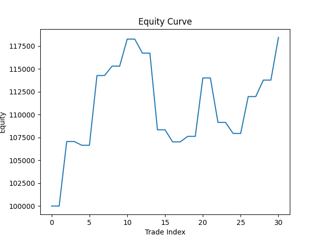

# Backtesting Engine

The project is a backtesting engine written in C++ with the intention to simulate what a trade would've resulted in if a given strategy were followed.

The engine in itself is nowhere near a real-world working model but is an attempt to understand the architectural principles behind low latency systems and how high frequency trades (HFTs) are carried out in institutions like hedge funds and proprietary firms.

## Architectural Design

The simple skeleton model of the engine is as shown below:

`MarketEvent -> SignalEVent -> OrderEvent -> FillEvent -> Portfolio`

As can be seen, the project follows an event-driven pipeline. The strategy reacts to market events, then the orders are executed in the simulator and then the fills update the portfolio and PnL.

 The data so provided upon which the model is tested is that of ***NASDAQ Composite (IXIC)*** from August 1, 2025 to December 31, 2025 in the form of a CSV file having just two columns, one of **timeStamp** and other of **price**.

 ## Strategy ##

 The strategy chosen is ***Price vs Simple Moving Average*** with a fixed position size. 

 With transaction costs enabled, the strategy is not expected to yield profit.

 ## Analytics ##

 The analysis is generated from a python script using matplotlib.

 The equity is recorded at trade boundaries, that is on fill events. Because equity is recorded on fills rather than daily mark-to-market, the curve exhibits a step-like behavior.

 

 ## How To Run ##

### Main Engine ###

``` bash
g++ -std=c++17 src/main.cpp src/data/MarketDataHandler.cpp -o engine
./engine
```

### Analytics ###

Python analytics can be run using a virtual environment:
```bash
source .venv/bin/activate
python python/analytics.py
```

## Remarks ##

This project was built to check core system structure and correctness. Advanced features like strategy optimization, clocking, or tests were intentionally left out to keep the project clear and simple.