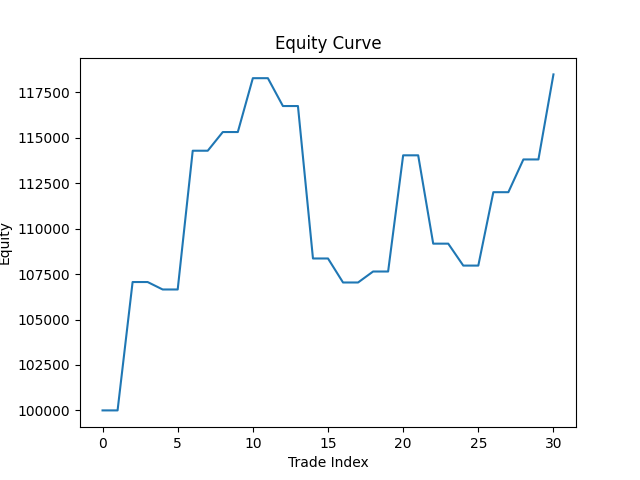
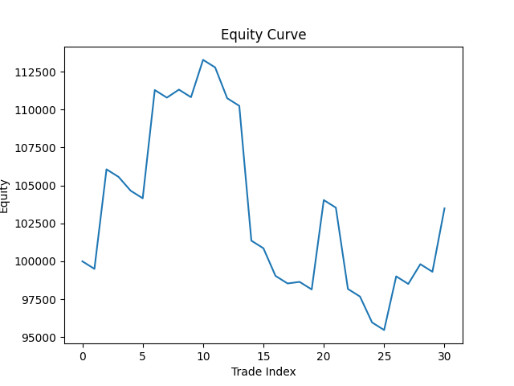

# Event-Driven Backtesting Engine

**Author: Sheryan Kumar**

**GitHub: https://github.com/shubhprime/Backtesting_Engine**

This report provides an analysis and describes the design of an event driven backtesting engine working under a strategy to carry out trades.

The engine follows a clean seperation policy, i.e., provides a seperation between input of market data, signal generation, order creation and transaction execution.

I use a price vs simple moving average strategy to carry out my analysis. I demonstrate how profitability degrades as real world metrics like transaction costs and execution delays are introduced.

## Architectural Design

The simple skeleton model of the engine is as shown below:

`MarketEvent -> SignalEvent -> OrderEvent -> FillEvent -> Portfolio`

As can be seen, the project follows an event-driven pipeline. The strategy reacts to market events, then the orders are executed in the simulator and then the fills update the portfolio and PnL.

Each layer introduces a new source of uncertainty:
* ***MarketEvent***: All data points are read and processed over here line by line
* ***Signal Event***: Provides a signal whether to **BUY** or '**SELL**
* ***OrderEvent***: Places intent that is derived from corresponding signal
* ***FillEvent***: Carries out the trade
* ***Portfolio***: A representation of PnL after execution of fill events

The data so provided upon which the model is tested is that of ***NASDAQ Composite (IXIC)*** from August 1, 2025 to December 31, 2025 in the form of a CSV file having just two columns, one of **timeStamp** and other of **price**.

## Strategy ##

The strategy chosen is ***Price vs Simple Moving Average*** with a fixed position size. 

With transaction costs enabled, the strategy is not expected to yield profit.

The strategy in itself is simple and was chosen to ensure that:
* Results are interpretable and reproducible
* Assumptions made in the engine drive the outcomes
* No overfitting

No parameter adjustments were made to increase profitability. 

## Execution and Cost Modelling

The execution model includes:
* Fixed bid ask spread
* Immediate fills at adjusted price

## Analytics and Results ##

The analysis is generated from a python script using matplotlib.

The equity is recorded at trade boundaries, that is on fill events. Because equity is recorded on fills rather than daily mark-to-market, the curve exhibits a step-like behavior.

The engine was tested in three settings, one in which transaction costs were set to **USD 1**, the second when transaction costs were disabled and third when the transaction costs were set at **USD 500**. 

## Equity Curve at ***USD 1*** Transaction Cost ##

## Equity Curve at ***NO*** Transaction Cost ##

## Equity Curve at ***USD 500*** Transaction Cost ##

Due to the high magnitude of the NASDAQ stock price, visually no difference can be made out in the 1 USD and no transaction cost state. To overcome this, I used an extreme case where the transaction cost would be 500 USD. Clearly this is an over exaggerated case but the intention of this engine is to observe the variance in data and trades when different parameters are brought into play.

When comparing the over exaggerated run and the 1 USD run, the 1 USD run becomes the no transaction cost run. From the graphs, we observe a few things:

* **1 USD transaction fee run**: The strategy is smart enough to pickup winning trades and grow the portfolio from 100,000 to 118,500, the engine essentially traded 30 times. But each time the engine bought or sold, it shaved off a small amount in fees. Even though the final profit seems appreciable, it's still lower than the mathematical ideal.

* **0 USD transaction fee run**: In a perfect environment with zero transaction costs, the strategy achieves a maximum potential value of 118,490 USD spread across 30 trade events. However, the introduction of even a nominal $1$ USD fee results in a systematic erosion of capital, reducing the final profit by exactly $1$ unit per trade ($118,460$ final).

* **500 USD transaction fee run**: This run reveals the strategy's biggest weakness. It trades too often. When costs are low, frequent trading is invisible. But when costs are high, that's when the entry fee becomes more expensive than the profit it actually generates. That's why we can see a huge dip in the curve in the intermediate points. To simulate realistic conditions, the 500 transaction fee can be taken as broker fees.

All in all, the curve still trends upwards in all three cases. This tell us the strategy exhibits positive growth returns and it performed decent. For a nominal fee of 1 USD, we see the engine performs good and delivers appreciable alpha, however when costs soar upto 500 USD, we can see an 80% consumption of the total profit by transaction fees alone. The strategy is strong enough to survive small fees, but not strong enough to survive high-cost environments.

The difference in values per trade can be observed from the CSV files for each setting by running the program.

## Vulnerabilities

* Unrealistic Fills: Overestimates fill quality as orders are filled immediately, no slippage, fill price is the reference price.
* Overtrading: Price vs SMA flips often resulting in the equity curve flipping downwards.

* No Event Prioritization: Orders are processed FIFO. No concept of latency.

## Conclusion

This project demonstrates that apparent strategy performance is highly sensitive to modeling assumptions, execution costs, and parameter stability.
Even simple strategies can appear profitable under idealized conditions, but quickly deteriorate once realistic constraints are introduced.
By emphasizing system design and failure analysis over alpha generation, this work highlights the importance of treating backtesting as a tool for falsifying models rather than validating them.
The framework provides a foundation for evaluating financial models under realistic trading conditions and will be extended to study option hedging and volatility dynamics.